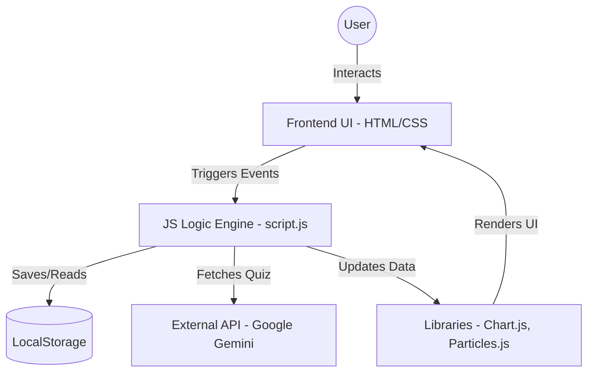
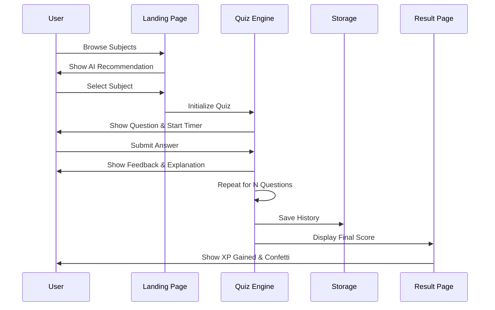

# 🏗️ GATE Master: System Design & Architecture

This document outlines the architectural design and data flow of the **GATE Master** application.

---

## 1. High-Level Architecture

The application follows a **Client-Side Heavy (Single Page Application)** architecture. Since it doesn't require a backend for basic features, all logic, state management, and data persistence happen within the user's browser.

---

## 2. Core Modules

### A. Quiz Engine
- **Responsibility**: Manages the quiz lifecycle (Start -> Question -> Answer -> Result).
- **Data Flow**: Pulls from `quizData` (Static) or Gemini API (Dynamic), calculates scores, and feeds results to the Storage Module.

### B. Gamification & XP System
- **Responsibility**: Calculates user Level, XP, and Streaks based on history.
- **Logic**: XP = Correct Answers * 10. Level = Floor(XP / 100) + 1.

### C. Analytics Module
- **Responsibility**: Visualizes performance history.
- **Library**: Uses **Chart.js** to map `quizHistory` from LocalStorage onto a line chart.

### D. AI Integration Layer
- **Responsibility**: Communicates with the Gemini Pro model.
- **Flow**: User Input -> Prompt Engineering -> Fetch -> JSON Parsing -> Quiz Injection.

---

## 3. Data Schema (LocalStorage)

The application uses key-value pairs in `localStorage` to persist state:

| Key | Format | Purpose |
|-----|--------|---------|
| `userName` | String | Stores user display name. |
| `quizHistory` | JSON Array | Array of objects `{subject, score, date}`. |
| `userStreak` | Integer | Consecutive days of activity. |
| `lastActiveDate` | Date String | Last date the user attempted a quiz. |
| `syllabusCompleted` | JSON Array | List of completed topics. |
| `theme` | String | 'light' or 'dark' preference. |

---

## 4. UI/UX Flow

---

## 5. External Dependencies

1. **Google Gemini API**: For dynamic content generation.
2. **Chart.js**: For performance visualization.
3. **SweetAlert2**: For interactive popups and settings.
4. **Particles.js**: For aesthetic background animations.
5. **Canvas Confetti**: For gamification celebrations.

---

## 6. Scalability & Future Scope

- **Backend Integration**: Move `localStorage` to a **Node.js/MongoDB** backend for cross-device sync.
- **PWA (Progressive Web App)**: Add Service Workers for true offline capability.
- **Multiplayer Mode**: Implement **WebSockets** for real-time head-to-head quizzes.
- **Deep Analytics**: Predict user performance based on historical trends using ML.
